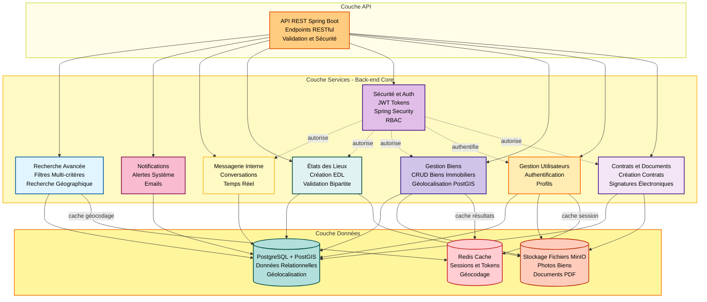
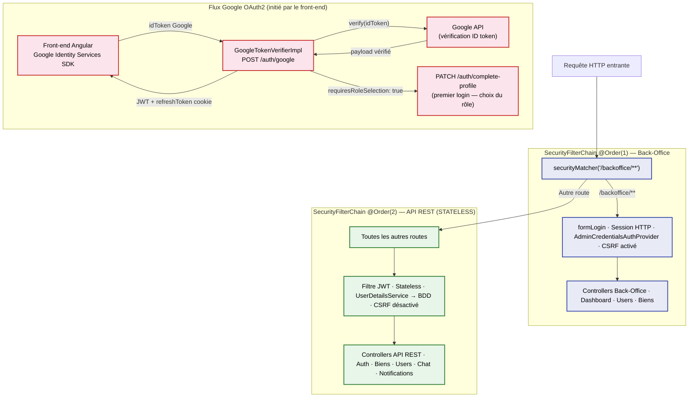
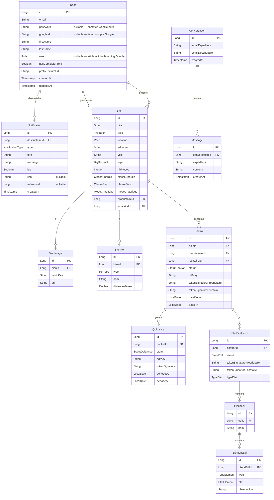
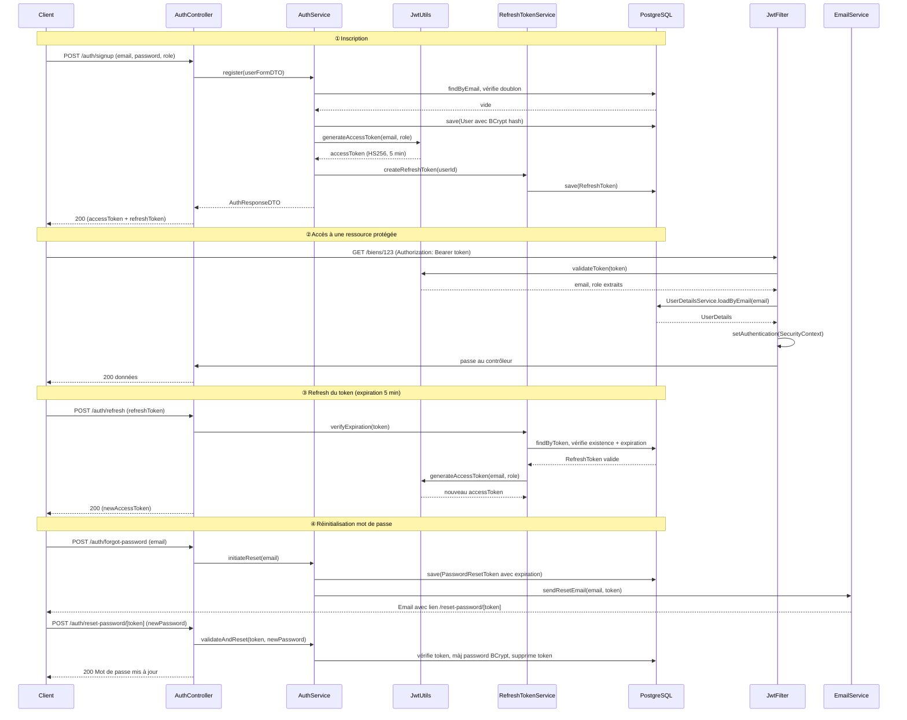
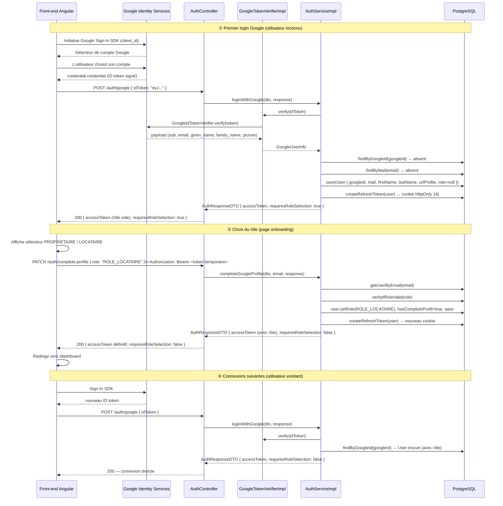
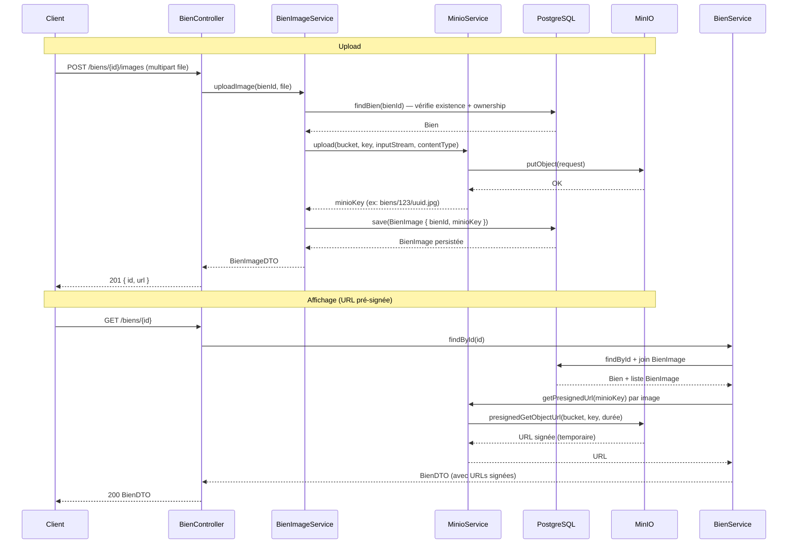
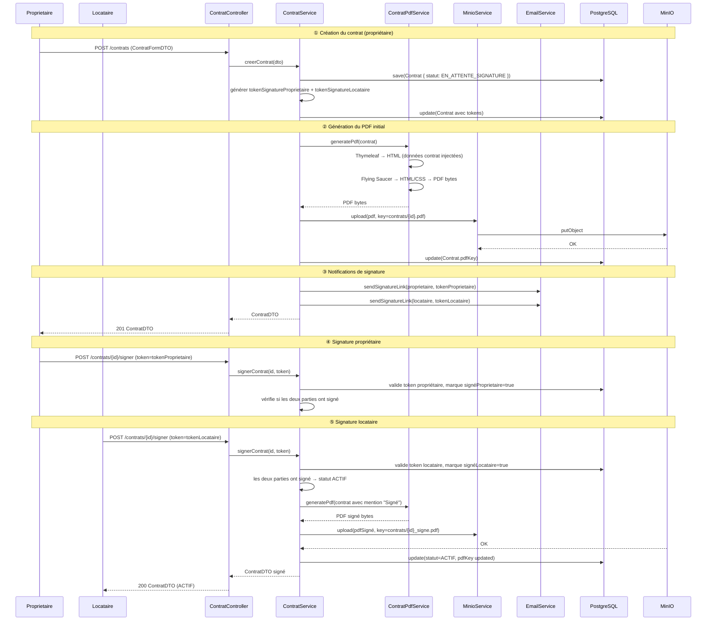
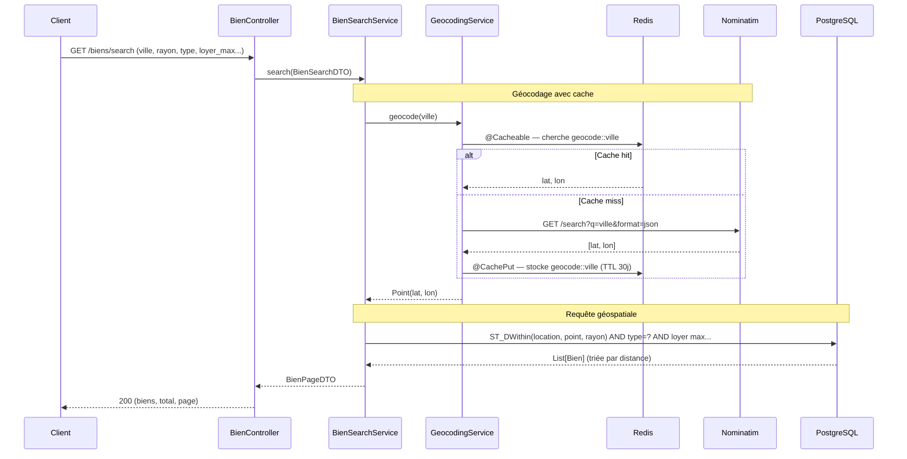
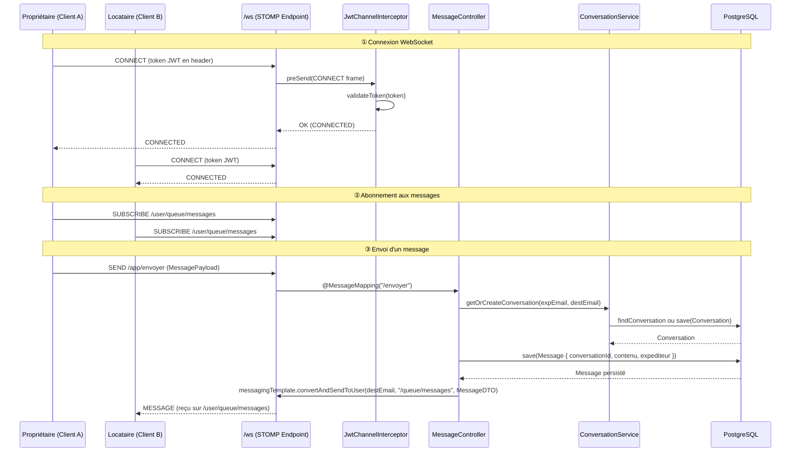
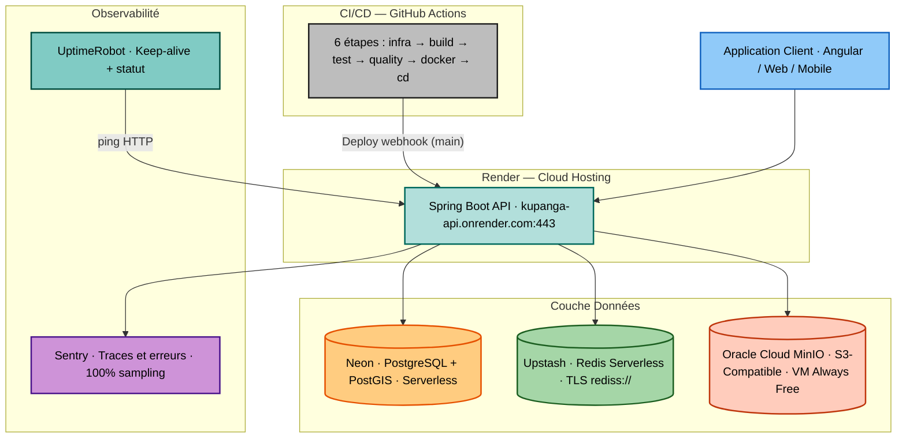

# Document d'Architecture Technique — Kupanga API


> Version : 1.0 — Mai 2026  
> Auteur : Moïse  
> Statut : Actif

---

## Table des matières

1. [Vision produit & contexte](#1-vision-produit--contexte)
2. [Stack technique justifiée](#2-stack-technique-justifiée)
3. [Architecture applicative](#3-architecture-applicative)
4. [Sécurité](#4-sécurité)
5. [Couche données](#5-couche-données)
6. [Flux principaux (séquences)](#6-flux-principaux-séquences)
7. [Infrastructure & DevOps](#7-infrastructure--devops)
8. [Tests & Qualité](#8-tests--qualité)
9. [Contraintes non-fonctionnelles](#9-contraintes-non-fonctionnelles)
10. [Décisions d'architecture (ADR)](#10-décisions-darchitecture-adr)
11. [Roadmap technique](#11-roadmap-technique)

---

## 1. Vision produit & contexte

### 1.1 Problème résolu

La gestion locative immobilière implique aujourd'hui une multiplication d'outils non interconnectés : annonces sur des plateformes tierces, contrats signés à la main, quittances générées manuellement, communications par SMS ou email, états des lieux photographiés sans trace structurée. **Kupanga** centralise l'intégralité de ce cycle en un seul produit cohérent.

### 1.2 Périmètre fonctionnel

| Module | Couverture |
|:---|:---|
| Authentification | Inscription, connexion classique (email/mot de passe), connexion Google OAuth2, refresh JWT, réinitialisation mot de passe par email |
| Gestion des biens | CRUD complet, géolocalisation, photos, points d'intérêt à proximité |
| Recherche avancée | Filtres multi-critères, rayon géographique, cache des résultats |
| Contrats de location | Création, workflow de signature bipartite, génération PDF |
| États des lieux | EDL d'entrée/sortie, inventaire par pièce et élément, signature bipartite |
| Quittances | Génération automatique, signature, suivi de paiement |
| Messagerie | Conversations temps réel entre propriétaire et locataire (WebSocket STOMP) |
| Notifications in-app | Notifications persistées en base + push WebSocket temps réel ; récupération des notifications manquées à la reconnexion |
| Notifications email | Emails transactionnels (reset password, bienvenue, confirmation, alertes) |
| Back-Office | Interface admin web embarquée (Thymeleaf), tableau de bord, modération |

### 1.3 Utilisateurs cibles

- **Propriétaires** : publient leurs biens, gèrent leurs locataires, signent les documents
- **Locataires** : recherchent des biens, signent les documents, communiquent avec le propriétaire
- **Administrateurs** : modèrent via le back-office (aucune base de données requise pour leur auth)

---

## 2. Stack technique justifiée

### 2.1 Vue d'ensemble

| Couche | Technologie | Rôle |
|:---|:---|:---|
| **Runtime** | Java 21 (LTS) | Virtual threads, records, pattern matching |
| **Framework** | Spring Boot 3.2.2 | Conteneur IoC, auto-configuration, écosystème mature |
| **ORM** | Spring Data JPA + Hibernate Spatial | Accès base de données, support géospatial natif |
| **Sécurité** | Spring Security 6 + JWT (jjwt 0.11.5) | Authentification stateless, RBAC, double chaîne |
| **Google OAuth2** | google-api-client 2.2.0 (`GoogleIdTokenVerifier`) | Vérification côté serveur des ID tokens Google (flux initié par le front) |
| **Base de données** | PostgreSQL 15 + PostGIS | Données relationnelles + géospatiales |
| **Migrations** | Flyway 10 | Versioning du schéma, traçabilité |
| **Cache** | Redis (Spring Cache) | Géocodage, sessions WebSocket |
| **Stockage fichiers** | MinIO (S3-compatible) | Photos, PDFs, documents |
| **Messagerie temps réel** | WebSocket STOMP (Spring) | Chat propriétaire ↔ locataire |
| **Génération PDF** | Flying Saucer (XHTML Renderer) | Contrats, EDL, quittances depuis templates Thymeleaf |
| **Géocodage** | Nominatim (OpenStreetMap) via WebClient | Adresse → coordonnées GPS |
| **Emails** | Spring Mail + Gmail SMTP | Emails transactionnels |
| **Mappers** | MapStruct 1.5 | Conversion DTO ↔ Entity à la compilation |
| **Documentation API** | SpringDoc OpenAPI 3 (Swagger UI) | Documentation interactive avec auth JWT |
| **Monitoring** | Sentry + Spring Actuator | Tracking d'erreurs, métriques, traces |
| **Build** | Maven + GitHub Actions | CI/CD automatisé |
| **Déploiement** | Render (cloud) | Déploiement continu depuis `main` |

### 2.2 Choix du langage et du runtime

**Java 21** a été retenu comme LTS actuel offrant les fonctionnalités les plus modernes : les *virtual threads* de Project Loom (disponibles via `@Async` dans Spring Boot 3.2) améliorent la densité de threads pour les opérations I/O-bound (appels Nominatim, uploads MinIO, envois email) sans réécriture du code métier. Les *records* Java simplifient les DTOs immuables.

**Spring Boot 3.2** s'impose comme le standard industriel pour les APIs REST Java d'entreprise. L'auto-configuration réduit le boilerplate, l'écosystème (Security, Data, Mail, WebSocket, Cache, Actuator) couvre tous les besoins de Kupanga sans dépendances exotiques.

---

## 3. Architecture applicative

### 3.1 Structure des packages

L'application est organisée en **modules métier verticaux** plutôt qu'en couches horizontales globales. Chaque module possède ses propres contrôleurs, services, repositories, entités et DTOs, ce qui facilite l'évolution indépendante de chaque domaine.

```
com.kupanga.api/
│
├── authentification/         ← Module auth (JWT, refresh, reset password)
│   ├── controller/           AuthController.java
│   ├── service/impl/         AuthServiceImpl, RefreshTokenServiceImpl…
│   ├── filter/               JwtFilter.java
│   ├── entity/               RefreshToken, PasswordResetToken
│   └── utils/                JwtUtils.java
│
├── immobilier/               ← Module métier principal
│   ├── controller/           BienController, ContratController, EtatDesLieuxController, QuittanceController
│   ├── service/              BienService, ContratService, EtatDesLieuxService, QuittanceService…
│   ├── pdf/                  ContratPdfService, EtatDesLieuxPdfService, QuittancePdfService
│   ├── research/             BienSearchService, PoiSearchService (+ Specification + DTOs)
│   ├── entity/               Bien, Contrat, EtatDesLieux, Quittance, Document, BienImage, BienPoi…
│   └── validation/           @NoUrl, @DateBailValide (validators custom Jakarta)
│
├── chat/                     ← Module messagerie temps réel
│   ├── config/               WebSocketConfig.java (STOMP)
│   ├── controller/           MessageController (WebSocket), ConversationController (REST)
│   ├── security/             JwtChannelInterceptor.java
│   └── entity/               Message, Conversation
│
├── user/                     ← Module utilisateurs
│   ├── controller/           UserController.java
│   ├── entity/               User.java, Role.java (enum)
│   └── research/             LocataireSpecification (recherche paginée)
│
├── backoffice/               ← Back-Office admin isolé (Thymeleaf)
│   ├── config/               BackOfficeSecurityConfig.java (@Order 1)
│   ├── controller/           Dashboard, Users, Biens, Auth, Analytics
│   └── specification/        UserAdminSpecification, BienAdminSpecification
│
├── minio/                    ← Module stockage fichiers
│   └── service/impl/         MinioServiceImpl.java
│
├── email/                    ← Module email transactionnel
│   └── service/impl/         EmailServiceImpl.java
│
├── config/                   ← Configuration transversale
│   ├── SecurityConfig.java   (JWT, @Order 2)
│   ├── AppConfig.java        (WebClient, Redis Cache)
│   ├── AsyncConfig.java      (@EnableAsync)
│   └── OpenApiConfig.java    (Swagger Bearer JWT)
│
└── exception/                ← Gestion centralisée des erreurs
    ├── GlobalExceptionHandler.java (@RestControllerAdvice)
    └── business/             InvalidRoleException, UserAlreadyExistsException…
```

### 3.2 Architecture en couches

Chaque module suit une architecture en **4 couches strictes** :

```
┌─────────────────────────────────┐
│  Controller  (@RestController)  │  ← Validation entrée, mapping HTTP, Swagger
├─────────────────────────────────┤
│  Service  (@Service)            │  ← Logique métier, transactions, cache
├─────────────────────────────────┤
│  Repository  (Spring Data JPA)  │  ← Requêtes BDD, Specifications JPA
├─────────────────────────────────┤
│  Entity / DTO  (JPA + MapStruct)│  ← Modèles de données, mapping
└─────────────────────────────────┘
```

**Règle de dépendance** : les dépendances ne vont que dans le sens descendant. Un Controller ne connaît jamais un Repository directement. Un Entity ne connaît jamais un DTO.

### 3.3 Patterns clés

| Pattern | Implémentation | Bénéfice |
|:---|:---|:---|
| **Specification** | `LocataireSpecification`, `BienAdminSpecification` | Requêtes dynamiques sans JPQL concaténé |
| **Builder** | Lombok `@Builder` sur entités et DTOs | Construction lisible d'objets complexes |
| **Mapper** | MapStruct (compilation, pas de réflexion) | Conversion DTO↔Entity sans code manuel ni overhead runtime |
| **Filter Chain** | `JwtFilter` extends `OncePerRequestFilter` | Interception JWT propre, une seule exécution par requête |
| **Async** | `@Async` + `AsyncConfig` | Calcul POI et envoi email hors du thread HTTP |
| **Global Exception Handler** | `@RestControllerAdvice` | Format d'erreur uniforme sur toute l'API |

### 3.4 Vue d'ensemble des modules



---

## 4. Sécurité

### 4.1 Vue d'ensemble

Kupanga fait coexister deux mécanismes d'authentification totalement séparés sur le même serveur Spring Boot, grâce à deux `SecurityFilterChain` ordonnés.



### 4.2 Authentification JWT (API REST)

**Caractéristiques du token :**
- Algorithme : HMAC-SHA256 (HS256)
- Durée de vie : 5 minutes (300 000 ms)
- Payload : `sub` (email), `role` (vide `""` pour les nouveaux utilisateurs Google), `iat`, `exp`
- Clé de signature : variable d'environnement `JWT_SECRET_KEY`

**Flux classique (email / mot de passe) :**
1. Le client envoie ses credentials (`POST /auth/login`)
2. `AuthServiceImpl` vérifie via `BCryptPasswordEncoder`
3. `JwtUtils.generateAccessToken(email, role)` signe le token HS256
4. Un `RefreshToken` (longue durée, 14 jours) est persisté en base et envoyé dans un cookie HttpOnly
5. L'`accessToken` est retourné dans `AuthResponseDTO`
6. À chaque requête, `JwtFilter` extrait le Bearer, valide signature + expiration, charge `UserDetails` depuis la BDD, alimente le `SecurityContext`

**Comportement du JwtFilter avec un token sans rôle :**
Lors du flux Google OAuth2, le token temporaire ne contient pas de rôle (`role: ""`). `UserDetailsServiceImpl.loadUserByUsername()` retourne un `UserDetails` avec une liste d'authorities vide (au lieu de lever une exception). Le JwtFilter accepte ce token et construit l'`Authentication` normalement — permettant l'accès à `PATCH /auth/complete-profile`.

**Refresh token :**
- Entité `RefreshToken` persistée en PostgreSQL (contrainte UNIQUE sur `user_id`)
- Échange via `POST /auth/refresh` (cookie HttpOnly `refreshToken`)
- Rotation du token : l'ancien est supprimé avant l'insertion du nouveau (flush JPA explicite pour respecter la contrainte UNIQUE)
- Permet des sessions longues sans stocker l'access token côté serveur

**Sécurité WebSocket :**
- `JwtChannelInterceptor` valide le JWT lors de la connexion STOMP sur `/ws`
- Déconnexion immédiate si token invalide ou expiré
- Token transmis en header ou query param lors de la handshake

### 4.5 Authentification Google OAuth2 (flux initié par le front-end)

Kupanga supporte la connexion via Google en mode **Frontend-Initiated Flow** : le front-end obtient l'ID token auprès de Google Identity Services, puis l'envoie au back-end pour vérification.

**Étape 1 — `POST /auth/google`**
1. Le front-end envoie `{ idToken: "eyJ..." }` (ID token Google)
2. `GoogleTokenVerifierImpl` appelle `GoogleIdTokenVerifier` (bibliothèque `google-api-client`) pour valider la signature et l'audience (`GOOGLE_CLIENT_ID`)
3. L'utilisateur est retrouvé par `googleId`, puis par email (liaison automatique d'un compte existant), ou créé sans rôle
4. Un JWT temporaire (sans rôle) et un cookie `refreshToken` sont émis
5. `AuthResponseDTO.requiresRoleSelection: true` signale au front qu'un rôle doit être choisi

**Étape 2 — `PATCH /auth/complete-profile`** *(uniquement si premier login)*
1. Le front-end envoie `{ role: "ROLE_LOCATAIRE" | "ROLE_PROPRIETAIRE" }` avec le JWT temporaire
2. Le back-end assigne le rôle, met `hasCompleteProfil: true`, émet un nouveau JWT complet
3. `requiresRoleSelection: false` — l'utilisateur est pleinement authentifié

**Cas de liaison automatique :** si un compte email/mot de passe préexiste avec le même email Google, le `googleId` est automatiquement lié au compte existant lors du premier `POST /auth/google`.

**Interface `GoogleTokenVerifier` :** découple la vérification réelle (appel Google API) du code métier, permettant son mock complet en tests unitaires sans appel réseau.

### 4.3 Contrôle d'accès (RBAC)

Trois rôles : `PROPRIETAIRE`, `LOCATAIRE`, `ADMIN` (enum `Role`).

Le contrôle s'effectue à deux niveaux :
- **Filtre Spring Security** : `@EnableMethodSecurity` + `@PreAuthorize` sur les endpoints sensibles
- **Logique métier** : vérification de propriété des ressources dans les services (ex. : un locataire ne peut pas modifier un bien qu'il ne loue pas)

### 4.4 Back-Office admin

L'authentification du back-office est **volontairement déconnectée de la base de données** :
- `AdminCredentialsAuthProvider` compare les credentials avec `ADMIN_EMAIL` / `ADMIN_PASSWORD` (variables d'environnement)
- Session HTTP Spring Security classique (formLogin)
- CSRF activé (contexte navigateur, non API)
- Aucun utilisateur admin en base, aucun JWT

Cette architecture garantit que même en cas de compromission totale de la base utilisateurs, l'accès admin reste protégé par une couche indépendante.

---

## 5. Couche données

### 5.1 Modèle de données



### 5.2 PostgreSQL + PostGIS

**Géolocalisation :**  
Les biens stockent leurs coordonnées comme un `Point` JTS (Java Topology Suite) en WGS84 (`SRID 4326`), persisté nativement via Hibernate Spatial. Les requêtes géospatiales (recherche dans un rayon) utilisent les fonctions PostGIS `ST_DWithin` et `ST_Distance` directement depuis les Specifications JPA, sans besoin d'une couche géospatiale externe.

**Flyway — 34 migrations :**  
Le schéma évolue exclusivement via Flyway. Chaque version est irréversible et tracée en base (`flyway_schema_history`). Le DDL Hibernate est configuré en mode `validate` : Hibernate ne modifie jamais le schéma, il se contente de valider la cohérence avec les entités.

| Plage | Domaine |
|:---|:---|
| V1–V10 | Schéma initial : utilisateurs, biens, contrats, documents, EDL, quittances, messagerie, tokens |
| V11–V15 | Enrichissement : images, POI, caractéristiques techniques des biens |
| V16–V22 | EDL détaillé : pièces, éléments, compteurs, clés, tokens signature |
| V23–V32 | Refonte quittances, messagerie vers conversations, champs email |
| V33 | Notifications in-app : table `notifications` (destinataire FK, type, titre, message, lue, lien, referenceId, createdAt) + index composite `(destinataire_id, lue)` |
| V34 | Google OAuth2 : colonne `google_id VARCHAR(255)` nullable sur `utilisateurs` + index `idx_utilisateurs_google_id` + `mot_de_passe` rendu nullable (comptes Google purs) |

### 5.3 Redis — Stratégie de cache

| Donnée cachée | TTL | Clé |
|:---|:---|:---|
| Résultats géocodage Nominatim | 30 jours | `geocode::<adresse>:<code_postal>` |
| Résultats de recherche de biens | 30 jours | Pattern custom |

Le cache est annoté `@Cacheable` / `@CacheEvict` sur les méthodes de service. Le TTL de 30 jours est un compromis entre fraîcheur des données géographiques (stables) et consommation mémoire Upstash. La suppression d'un bien invalide les entrées de cache associées via `@CacheEvict`.

### 5.4 MinIO — Stockage fichiers

MinIO expose une API S3-compatible. Les buckets sont organisés par type de contenu :
- **Photos de biens** : référencées par `BienImage.minioKey`
- **PDFs générés** : Contrats (`Contrat.pdfKey`), Quittances (`Quittance.pdfKey`), EDL
- **Documents d'identité** : profil utilisateur

Les URLs publiques ou pré-signées sont générées à la demande par `MinioServiceImpl` et jamais stockées en dur (sauf la clé MinIO). Cette approche découple les URLs de la configuration du serveur de stockage.

---

## 6. Flux principaux (séquences)

### 6.1 Authentification JWT complète



### 6.2 Authentification Google OAuth2 (flux complet)



### 6.3 Upload et affichage d'une photo de bien



### 6.4 Génération PDF d'un contrat et workflow de signature



### 6.5 Recherche géospatiale de biens



### 6.6 Chat temps réel (WebSocket STOMP)



---

## 7. Infrastructure & DevOps

### 7.1 Architecture d'infrastructure



### 7.2 Pipeline CI/CD (GitHub Actions)

Le pipeline s'exécute sur chaque push vers `main`, `develop` et `feature/**`, ainsi que sur les PRs vers `main` et `develop`.

```
push/PR
  └─ infra           ← PostgreSQL + PostGIS + Flyway migrations + MinIO
       └─ build      ← mvn clean install -DskipTests
            ├─ test  ← mvn test (Testcontainers PostgreSQL + MinIO isolés)
            └─ quality ← Semgrep (analyse statique Java)
                 └─ docker  ← Build image Docker
                      └─ cd  ← Deploy Render webhook (main uniquement)
```

**Points clés :**
- Les services (PostgreSQL PostGIS, MinIO) sont démarrés en conteneurs GitHub Actions lors de la phase `infra`, **et à nouveau en conteneurs Testcontainers isolés** lors de la phase `test` — garantissant que les tests ne dépendent pas de l'état des migrations CI
- Flyway s'exécute manuellement en CI (`SPRING_FLYWAY_ENABLED=false` côté tests, Flyway CLI côté infra)
- Semgrep en parallèle des tests (sans bloquer si tests passent)
- Le déploiement Render via webhook ne s'exécute que si toutes les étapes précédentes réussissent **et** uniquement sur la branche `main`

### 7.3 Configuration multi-profils

| Profil | Activation | BDD | Redis | MinIO | Cookies |
|:---|:---|:---|:---|:---|:---|
| `dev` | défaut | localhost:5432 | localhost:6379 | localhost:9000 | `secure=false`, `SameSite=Lax` |
| `test` | CI (`-Dspring.profiles.active=test`) | Testcontainers | Testcontainers | Testcontainers MinIO | — |
| `prod` | `SPRING_PROFILES_ACTIVE=prod` | Neon (env var) | Upstash TLS (env var) | Oracle Cloud (env var) | `secure=true`, `SameSite=None` |

### 7.4 Variables d'environnement (production)

| Variable | Usage |
|:---|:---|
| `DB_URL` | URL JDBC PostgreSQL (Neon) |
| `POSTGRES_USER` / `POSTGRES_PASSWORD` | Credentials BDD |
| `JWT_SECRET_KEY` | Clé de signature JWT (HS256) |
| `MAIL_USERNAME` / `MAIL_PASSWORD` | Gmail SMTP |
| `MINIO_ENDPOINT` / `MINIO_ACCESS_KEY` / `MINIO_SECRET_KEY` | Stockage fichiers |
| `REDIS_URL` | Upstash Redis (`rediss://`) |
| `ADMIN_EMAIL` / `ADMIN_PASSWORD` | Credentials back-office admin |
| `GOOGLE_CLIENT_ID` | Client ID Google OAuth2 — doit correspondre à celui déclaré dans Google Cloud Console |
| `SENTRY_DSN` | Endpoint Sentry |
| `RENDER_DEPLOY_HOOK` | GitHub Secret — webhook Render |

---

## 8. Tests & Qualité

### 8.1 Stratégie de tests

L'objectif de couverture est fixé à **80 % minimum** (branches métier critiques), avec exclusion des DTOs, entités, configs, code MapStruct/Lombok et **contrôleurs back-office Thymeleaf** — configuré dans le plugin JaCoCo.

La suite compte **43 classes de test** pour **328 tests**, construite en 4 sprints + extensions fonctionnelles.

```
Tests (43 classes)
│
├── Sprint 1 & 2 — Socle (25 classes)
│   ├── Tests unitaires services/utils/exceptions (12 classes)
│   ├── Tests intégration contrôleurs @WebMvcTest (9 classes)
│   └── Tests configuration + démarrage (3 classes)
│
├── Sprint 3 — Services métier avancés (4 classes)
│   ├── GeocodingServiceTest         ← Nominatim WebClient, ObjectMapper
│   ├── BienImageServiceImplTest     ← Upload multi-fichiers, MinIO
│   ├── BienPoiServiceImplTest       ← Calcul POI asynchrone
│   └── PoiSearchServiceTest         ← Agrégation POI par catégorie
│
├── Sprint 4 — Intégration @DataJpaTest — Specifications (8 classes)
│   ├── BienSpecificationTest        ← 6 filtres (ville, loyer, type, titre…)
│   ├── ContratSpecificationTest     ← 5 filtres (proprio, locataire, statut…)
│   ├── QuittanceSpecificationTest   ← 5 filtres (année, mois, statut…)
│   ├── EtatDesLieuxSpecificationTest ← 3 actifs + 2 @Disabled (bug PostgreSQL)
│   ├── LocataireSpecificationTest   ← 3 filtres via sous-requête conversation
│   ├── ConversationSpecificationTest ← 3 filtres (participant, bien, lu/non lu)
│   ├── BienAdminSpecificationTest   ← 4 filtres admin
│   └── UserAdminSpecificationTest   ← 5 filtres admin
│
├── Sprint 4 — Tests unitaires services admin (3 classes)
│   ├── BienAdminServiceTest         ← 7 tests (recherche, stats, agrégations)
│   ├── UserAdminServiceTest         ← 6 tests (suppression ordonnée, compteurs)
│   └── DocumentAdminServiceTest     ← 8 tests (compteurs, agrégations par bien)
│
└── Extensions fonctionnelles (3 classes)
    ├── NotificationServiceImplTest  ← 7 tests (persistance, push WS, marquer lue/toutes)
    ├── NotificationControllerWebMvcTest ← 5 tests (GET non lues, PATCH lire, PATCH lire-toutes)
    └── AuthServiceImplTest (étendu) ← +7 tests Google OAuth2 (loginWithGoogle, completeGoogleProfile)
        AuthControllerWebMvcTest (étendu) ← +6 tests Google endpoints (POST /google, PATCH /complete-profile)
```

### 8.2 Sprint 1 & 2 — Socle (25 classes)

**Tests unitaires (12 classes)**

| Classe | Domaine | Couverture |
|:---|:---|:---|
| `AuthServiceImplTest` | Auth | Inscription, login, tokens, doublons |
| `UserServiceImplTest` | Utilisateurs | CRUD, vérifications de rôle |
| `JwtUtilsTest` | JWT | Génération, validation, expiration HS256 |
| `JwtFilterTest` | Sécurité | Filtre Spring Security, tokens valides/invalides |
| `UserDetailsServiceImplTest` | Auth | Chargement `UserDetails` depuis BDD |
| `PasswordResetTokenServiceImplTest` | Auth | Workflow reset password, expiration token |
| `RefreshTokenServiceImplTest` | Auth | Cycle refresh, invalidation |
| `MinioServiceImplTest` | Fichiers | Upload, présignature, suppression |
| `EmailServiceImplTest` | Email | Envoi email (SMTP mocké) |
| `InvalidRoleExceptionTest` | Exceptions | Levée et message |
| `UserAlreadyExistsExceptionTest` | Exceptions | Levée et message |
| `UserNotFoundExceptionTest` | Exceptions | Levée et message |

**Tests d'intégration contrôleurs (`@WebMvcTest` + `@MockBean`)**

| Classe | Endpoints couverts |
|:---|:---|
| `AuthControllerWebMvcTest` | `/auth/signup`, `/login`, `/refresh`, `/forgot-password` |
| `UserControllerWebMvcTest` | `/users/**` |
| `BienControllerWebMvcTest` | `/biens/**` |
| `ContratControllerWebMvcTest` | `/contrats/**` |
| `EtatDesLieuxControllerWebMvcTest` | `/etats-des-lieux/**` |
| `QuittanceControllerWebMvcTest` | `/quittances/**` |
| `ConversationControllerWebMvcTest` | `/conversations/**` |
| `MessageControllerWebMvcTest` | WebSocket STOMP messages |
| `HealthControllerWebMvcTest` | `/health` |

**Configuration et démarrage**

| Classe | Couverture |
|:---|:---|
| `SecurityConfigTest` | Chaînes de sécurité, CORS |
| `MinioConfigTest` | Initialisation client MinIO |
| `ApiApplicationTests` | Démarrage du contexte Spring complet |

### 8.3 Sprint 3 — Services métier avancés (4 classes)

Tests unitaires Mockito (`@Mock`, `@InjectMocks`) pour les services à dépendances externes (WebClient, MinIO) :

| Classe | Tests | Points notables |
|:---|:---:|:---|
| `GeocodingServiceTest` | 3 | Réponse Nominatim → `Point` ; tableau vide → `null` ; erreur WebClient → `null`. Mocks WebClient en types bruts (sans `<?>`) + `@Spy ObjectMapper` réel. |
| `BienImageServiceImplTest` | 2 | Upload N fichiers → `saveAll(List<BienImage>)` ; liste vide → aucun appel MinIO. `ArgumentCaptor<List<BienImage>>`. |
| `BienPoiServiceImplTest` | 3 | Localisation nulle → pas de sauvegarde ; 4 POI créés si localisation présente ; `BienPoi::getPresent` (`Boolean` wrapper, non `boolean`). |
| `PoiSearchServiceTest` | 3 | Compteurs corrects par catégorie de POI ; éléments vides → zéro ; erreur WebClient → zéro. |

### 8.4 Sprint 4 — Intégration JPA et services admin (11 classes)

#### Tests d'intégration `@DataJpaTest` — Specifications (8 classes)

Toutes les classes partagent cette configuration pour cibler la base PostGIS réelle (Docker Compose service `db-test`, port `5434`, profil `test`) :

```java
@DataJpaTest
@AutoConfigureTestDatabase(replace = AutoConfigureTestDatabase.Replace.NONE)
@ActiveProfiles("test")
@TestPropertySource(properties = "spring.jpa.hibernate.ddl-auto=create-drop")
```

Les données de test sont insérées en `@BeforeEach` et automatiquement supprimées au rollback de la transaction `@DataJpaTest`. Les classes `*Specification` n'ayant aucune dépendance injectée, elles sont instanciées directement avec `new`.

| Classe | Actifs | Désactivés | Filtres couverts |
|:---|:---:|:---:|:---|
| `BienSpecificationTest` | 6 | 0 | Villes, loyer min/max, type, titre partiel (ILIKE), meublé, exclusion locataire actif |
| `ContratSpecificationTest` | 5 | 0 | Proprio, locataire, statut contrat, loyer minimum, date de début après |
| `QuittanceSpecificationTest` | 5 | 0 | Proprio, locataire, année, mois, statut quittance |
| `EtatDesLieuxSpecificationTest` | 3 | 2 | Role (proprio/locataire), type EDL, statut EDL |
| `LocataireSpecificationTest` | 3 | 0 | Locataires par bien via sous-requête conversation, prénom, email |
| `ConversationSpecificationTest` | 3 | 0 | Participant (expéditeur ou destinataire), titre du bien, messages non lus |
| `BienAdminSpecificationTest` | 4 | 0 | Titre, ville, type de bien, sans filtre |
| `UserAdminSpecificationTest` | 5 | 0 | Prénom, nom, email, rôle, sans filtre |

> **Bug documenté** — `EtatDesLieuxSpecification.parMois()` et `parAnnee()` utilisent `cb.function("MONTH"/"YEAR")`, des fonctions MySQL inexistantes en PostgreSQL (il faut `EXTRACT(MONTH FROM ...)`). Les 2 tests concernés sont désactivés par `@Disabled` — le code de production n'a pas été modifié.

#### Tests unitaires — Services d'administration (3 classes)

| Classe | Tests | Comportements couverts |
|:---|:---:|:---|
| `BienAdminServiceTest` | 7 | Recherche paginée, suppression, `countAll`, `countDistinctVilles`, `getBiensParVille` (agrégation `Object[]`), `getBiensParType`, page vide |
| `UserAdminServiceTest` | 6 | Recherche, suppression ordonnée RefreshToken → PasswordResetToken → User (vérifiée avec `InOrder`), suppression sans tokens, compteurs par rôle |
| `DocumentAdminServiceTest` | 8 | Compteurs totaux (contrats/EDL/quittances), agrégation `getDocumentsParBien`, tri décroissant, accès par domaine |

### 8.5 Exclusions JaCoCo

```xml
<excludes>
    <exclude>**/*DTO*</exclude>
    <exclude>**/entity/**</exclude>
    <exclude>**/config/**</exclude>
    <exclude>**/*MapperImpl*</exclude>
    <exclude>**/backoffice/controller/**</exclude>
</excludes>
```

Les contrôleurs back-office sont exclus car ils retournent des vues Thymeleaf dont la validation nécessite un contexte navigateur, hors périmètre des tests unitaires Spring.

### 8.6 Analyse statique

**Semgrep** (ruleset Java) s'exécute en parallèle des tests dans le pipeline CI. Il détecte :
- Injections SQL potentielles
- Mauvaises pratiques de sécurité Spring
- Concaténation de chaînes dans les requêtes JPA

---

## 9. Contraintes non-fonctionnelles

### 9.1 Performance

- **Cache géocodage** : les appels Nominatim (externe, latence variable) sont cachés 30 jours. Après le premier appel, la recherche géospatiale est entièrement servie depuis Redis + PostgreSQL — aucun appel réseau externe.
- **@Async** : le calcul des points d'intérêt (POI) et l'envoi d'emails s'exécutent hors du thread HTTP, rendant les endpoints concernés non bloquants du point de vue du client.
- **MapStruct** : les mappings DTO↔Entity sont générés à la compilation (byte-code pur), sans réflexion à l'exécution — impact nul sur la latence.
- **Pagination systématique** : toutes les listes exposées (biens, locataires, conversations) sont paginées. Aucune requête "SELECT * sans LIMIT" n'atteint la production.

### 9.2 Scalabilité

- L'API est **stateless** (JWT) : plusieurs instances peuvent tourner derrière un load balancer sans session partagée.
- Redis (Upstash) est partageable entre instances.
- MinIO (ou tout stockage S3-compatible) est externe et partagé.
- La base de données Neon est serverless : elle scale en lecture via des réplicas en lecture.
- La limite actuelle est Render Free Tier (1 instance, cold start possible) — prévu pour une montée en charge.

### 9.3 Disponibilité

- **UptimeRobot** maintient l'instance Render active via des pings keep-alive réguliers, évitant les cold starts en production.
- **Sentry** alerte en temps réel sur les erreurs non gérées avec contexte de stack trace complet.
- **Spring Actuator** expose `/actuator/health`, `/actuator/metrics` et `/actuator/prometheus` en production pour intégration avec des systèmes de monitoring externes.

### 9.4 Sécurité

- Secrets exclusivement en variables d'environnement, jamais commités.
- Tokens JWT de courte durée (5 min) limitant la fenêtre d'exploitation en cas de fuite.
- Refresh tokens persistés en base, révocables individuellement.
- Validation des entrées à la frontière système (`@Valid` sur tous les DTOs de formulaire, validateurs custom `@NoUrl`, `@DateBailValide`).
- Hachage des mots de passe BCrypt.
- CSRF activé sur le back-office (session HTTP dans un navigateur), désactivé sur l'API REST (stateless JWT).

### 9.5 Maintenabilité

- Architecture modulaire verticale : ajouter un nouveau domaine métier = créer un nouveau package isolé, sans toucher aux autres.
- Flyway garantit que le schéma peut être reproduit de zéro sur n'importe quel environnement.
- Javadoc générée sur les APIs publiques (`maven-javadoc-plugin`).
- JaCoCo mesure la couverture à chaque build CI.

---

## 10. Décisions d'architecture (ADR)

> Format : **Contexte → Décision → Alternatives considérées → Justification**

---

### ADR-001 : PostgreSQL + PostGIS pour la géolocalisation

**Contexte :** Kupanga nécessite des recherches de biens par rayon géographique (ex. : "biens dans un rayon de 5 km autour de Lyon") et le calcul de distances vers des points d'intérêt.

**Décision :** Utiliser PostgreSQL avec l'extension PostGIS et Hibernate Spatial.

**Alternatives considérées :**
- *Elasticsearch (geo_distance query)* : performant pour la recherche textuelle + géo, mais introduit une seconde source de vérité à synchroniser avec la BDD principale.
- *MongoDB (2dsphere index)* : document store inadapté au modèle relationnel fort de Kupanga (contrats, EDL liés aux biens et aux utilisateurs).
- *Calcul applicatif (haversine formula en Java)* : charge la JVM et ne profite pas des index géospatiaux de la BDD.

**Justification :** PostGIS transforme PostgreSQL en base de données géospatiale complète. `ST_DWithin` avec un index GIST est la solution la plus performante pour les requêtes de proximité. Hibernate Spatial permet d'utiliser les types géométriques JTS (`Point`) directement dans les entités JPA sans couche d'abstraction supplémentaire. La cohérence des données est préservée dans une seule base.

---

### ADR-002 : Redis pour le cache de géocodage

**Contexte :** La recherche de biens par ville appelle l'API Nominatim (OpenStreetMap) pour convertir une adresse en coordonnées GPS. Nominatim est externe, soumis à des limites de taux, et potentiellement lent.

**Décision :** Cacher les résultats de géocodage dans Redis avec un TTL de 30 jours via `@Cacheable`.

**Alternatives considérées :**
- *Cache applicatif (Caffeine, in-memory)* : disparaît au redémarrage, non partageable entre instances.
- *Table PostgreSQL "geocode_cache"* : fonctionne, mais introduit des I/O BDD pour du cache, et complique la gestion du TTL.
- *Sans cache* : chaque recherche appelle Nominatim — risque de rate limiting, latence ajoutée.

**Justification :** Les données géographiques (coordonnées d'une ville) sont stables sur 30 jours. Redis est déjà présent dans la stack. Le TTL long maximise le taux de hit. Upstash Redis en production offre un Redis serverless avec persistance.

---

### ADR-003 : Double SecurityFilterChain (JWT + Session HTTP)

**Contexte :** L'API REST utilise JWT (stateless), mais le back-office d'administration est une interface web Thymeleaf qui nécessite une session HTTP avec formLogin et CSRF.

**Décision :** Deux `SecurityFilterChain` Spring Security avec `@Order` et `securityMatcher`.

**Alternatives considérées :**
- *Un seul SecurityFilterChain mixte* : complexe, risque de confusion entre les modes stateless/stateful, configurations mutuellement exclusives.
- *Back-office déployé séparément* : surcoût opérationnel (second déploiement, second domaine, second certificat TLS).
- *Back-office également JWT* : nécessite de stocker un token admin quelque part dans le navigateur, complexifie l'expérience (pas de login form natif).

**Justification :** La solution `@Order(1)` + `securityMatcher("/backoffice/**")` est explicitement supportée par Spring Security 6 pour exactement ce cas d'usage. L'isolation est totale : les deux chaînes ne se voient pas. Le back-office peut avoir CSRF activé sans impacter l'API REST. L'authentification admin sans BDD (`AdminCredentialsAuthProvider`) renforce la sécurité — une compromission de la table `users` ne donne pas accès au back-office.

---

### ADR-004 : Flying Saucer pour la génération PDF

**Contexte :** Kupanga génère des PDFs de contrats, états des lieux et quittances avec mise en page fidèle à un document légal (en-têtes, tableaux, signatures).

**Décision :** Flying Saucer (XHTML Renderer) + templates Thymeleaf.

**Alternatives considérées :**
- *iText/OpenPDF* : API bas niveau, mise en page complexe par code Java. Licence AGPL pour iText 7 (incompatible usage commercial sans licence commerciale).
- *Apache PDFBox* : même problématique, encore plus bas niveau.
- *Jasper Reports* : puissant mais lourd, nécessite des fichiers `.jrxml` et une courbe d'apprentissage.
- *API externe (PDF.co, Gotenberg)* : dépendance réseau externe, coût, données sensibles (contrats) sortant du périmètre.

**Justification :** Flying Saucer convertit du HTML/CSS valide en PDF. Les templates Thymeleaf sont déjà utilisés pour le back-office — réutiliser le même moteur pour les PDFs est cohérent. La mise en page se fait en CSS (maîtrisé), pas en API Java. Les données sensibles restent dans l'infrastructure de Kupanga.

---

### ADR-005 : MapStruct vs ModelMapper pour les mappings

**Contexte :** Le projet expose des DTOs distincts des entités JPA. Un mécanisme de mapping est nécessaire pour convertir `Bien` → `BienDTO`, `UserFormDTO` → `User`, etc.

**Décision :** MapStruct (génération de code à la compilation).

**Alternatives considérées :**
- *ModelMapper* : réflexion à l'exécution, plus lent, comportement parfois surprenant sur les types complexes.
- *Mapping manuel* : verbeux, duplication de code, source de bugs à la maintenance.
- *BeanUtils (Apache Commons)* : réflexion, pas de type-safety, ne gère pas les types imbriqués.

**Justification :** MapStruct génère du code Java pur à la compilation via l'annotation processor. Les mappings sont type-safe, vérifiés au build, et aussi rapides qu'un mapping manuel. Les erreurs de mapping (champ renommé, type incompatible) sont détectées à la compilation, pas au runtime.

---

### ADR-006 : Flyway pour les migrations de schéma

**Contexte :** Le schéma évolue avec chaque feature. Une gestion des migrations est nécessaire pour que les environnements (dev, CI, prod) restent synchronisés.

**Décision :** Flyway avec 32 scripts SQL versionnés, DDL Hibernate en mode `validate`.

**Alternatives considérées :**
- *Liquibase* : même objectif, format XML/YAML plus verbeux. Flyway SQL pur est plus lisible et plus proche de ce que le DBA voit réellement.
- *`spring.jpa.hibernate.ddl-auto=update`* : dangereux en production (Hibernate peut supprimer des colonnes sans avertissement), non versionné, non rejouable.
- *Migrations manuelles* : non traçables, source d'erreurs humaines en déploiement.

**Justification :** Flyway garantit que le schéma peut être reproduit de zéro sur n'importe quel environnement en rejouant les scripts dans l'ordre. `validate` en mode Hibernate force la cohérence entre les entités et le schéma réel — si un champ est manquant, l'application refuse de démarrer plutôt que de silencieusement ignorer le problème.

---

### ADR-007 : MinIO vs AWS S3 direct

**Contexte :** Kupanga stocke des photos de biens, des PDFs de documents légaux et des pièces jointes d'EDL. Un stockage objet S3-compatible est nécessaire.

**Décision :** MinIO auto-hébergé sur Oracle Cloud Always Free.

**Alternatives considérées :**
- *AWS S3* : coût dès les premiers Go, dépendance à un fournisseur cloud américain, prix variable.
- *Cloudflare R2* : intéressant (sans frais de sortie), mais moins mature et moins documenté.
- *Stockage local (système de fichiers)* : non scalable, perd les fichiers au redéploiement sans volume persistant.

**Justification :** MinIO expose une API 100% compatible S3. Le client Java (`io.minio:minio`) fonctionne identiquement qu'il parle à MinIO ou à AWS S3. En dev, MinIO tourne en Docker. En prod, MinIO tourne sur une VM Oracle Cloud Always Free (coût : 0€). Si demain le besoin dépasse la capacité de la VM, le code ne change pas — seul l'endpoint change. Zéro vendor lock-in.

---

### ADR-008 : Testcontainers vs H2 pour les tests d'intégration

**Contexte :** Les tests qui touchent la couche données (repositories, services) nécessitent une base de données. Le choix du moteur de test impacte la fidélité des tests.

**Décision :** Testcontainers avec `postgres:15-alpine` + PostGIS et image MinIO.

**Alternatives considérées :**
- *H2 in-memory* : rapide, mais dialecte SQL différent de PostgreSQL (pas de `ST_DWithin`, pas de PostGIS, comportements JPA subtils différents). Les tests peuvent passer avec H2 et échouer en production sur du SQL PostgreSQL-spécifique.
- *Base de données CI dédiée* : fonctionne, mais crée un état partagé entre les runs CI parallèles — risque de pollution entre tests.
- *Mocks de repositories* : trop haut niveau, ne teste pas les requêtes JPA réelles.

**Justification :** Testcontainers démarre un vrai PostgreSQL + PostGIS dans un conteneur Docker isolé pour chaque suite de tests. Les requêtes géospatiales, les contraintes d'intégrité, et les comportements de Flyway sont testés sur le même moteur qu'en production. Le conteneur est détruit après les tests — aucun état partagé. Le surcoût de démarrage (5-10 secondes) est acceptable en CI.

---

### ADR-009 : Google OAuth2 — Flux initié par le front-end

**Contexte :** Kupanga souhaite proposer la connexion via Google pour réduire la friction à l'inscription. Deux architectures sont possibles : flux initié par le serveur (Spring OAuth2 Client, redirections) ou flux initié par le front-end (le front obtient l'ID token, l'envoie au back).

**Décision :** Flux initié par le front-end — le front Angular obtient l'ID token via Google Identity Services SDK et l'envoie à `POST /auth/google`. Le back-end vérifie le token avec `GoogleIdTokenVerifier` et émet un JWT interne.

**Alternatives considérées :**
- *Spring Security OAuth2 Client (flux serveur)* : intégration native Spring, mais impose des redirections HTTP côté serveur incompatibles avec une SPA Angular (la SPA ne contrôle pas le flux de redirection). Nécessite la gestion des callbacks OAuth côté back-end.
- *Firebase Authentication* : gère l'OAuth côté client et émet des tokens Firebase, mais introduit une dépendance Google Firebase dans toute la pile — contraire au principe de minimiser les dépendances externes pour des fonctions critiques.

**Justification :** L'architecture SPA (Angular) possède déjà un SDK Google Identity Services (`accounts.google.com/gsi/client`) qui gère le flux OAuth côté navigateur. Le back-end n'a besoin que de vérifier la validité du token reçu — rôle exactement couvert par `GoogleIdTokenVerifier`. L'interface `GoogleTokenVerifier` découple la vérification réelle du code métier, permettant un mock complet en tests unitaires sans appel réseau. La gestion en deux étapes (login → choix du rôle) via `requiresRoleSelection` est propre et extensible.

---

### ADR-010 : Notifications in-app — Persistance + Push WebSocket

**Contexte :** Des événements métier critiques (invitation à signer un contrat, EDL signé, quittance disponible, bien assigné) doivent informer l'utilisateur en temps réel s'il est connecté, et rester accessibles s'il était hors ligne.

**Décision :** Stratégie hybride — chaque notification est **d'abord persistée en base** (`notifications` table), puis **pushée via WebSocket** sur `/queue/app-notifications`. Si le push WebSocket échoue (utilisateur hors ligne), la notification reste en base avec `lue = false` et est récupérée au prochain login via `GET /notifications`.

**Alternatives considérées :**
- *WebSocket seul (sans persistance)* : notifications perdues si l'utilisateur est hors ligne.
- *Email uniquement* : déjà en place, mais ne gère pas l'interface in-app.
- *SSE (Server-Sent Events)* : push unidirectionnel, mais WebSocket est déjà dans la stack (chat). Évite d'introduire un second mécanisme.

**Justification :** La persistance garantit qu'aucune notification n'est perdue. Le push WebSocket offre l'immédiateté en temps réel. L'échec du push WebSocket est silencieusement ignoré (`try/catch` dans `NotificationServiceImpl`) — la persistance est le seul mécanisme fiable. Les destinations WebSocket sont séparées : `/queue/messages` (chat), `/queue/notifications` (alerte chat), `/queue/app-notifications` (notifications applicatives), évitant toute confusion de format côté front.

---

## 11. Roadmap technique

### Court terme (en cours)

| Tâche | Statut |
|:---|:---|
| Couverture de tests unitaires et d'intégration (JUnit 5 + Mockito) | Fait |
| Documentation Swagger complète (tous les endpoints) | Fait |
| JaCoCo — rapport de couverture | Intégré au build |
| Javadoc APIs publiques | Fait |
| Notifications in-app temps réel (WebSocket + persistance base) | Fait |
| Connexion Google OAuth2 (flux initié front-end, deux étapes) | Fait |
| `SessionCreationPolicy.STATELESS` sur la chaîne API REST | Fait |

### Moyen terme

| Tâche | Priorité |
|:---|:---|
| Restriction CORS (origines autorisées explicites en production) | Haute |
| Durée de vie JWT configurable par environnement | Moyenne |
| Pagination des conversations et messages | Moyenne |
| Tests E2E (Playwright ou Cucumber) pour les flux critiques | Basse |

### Long terme / Évolutions d'architecture

| Évolution | Motivation |
|:---|:---|
| Extraction du module email en service asynchrone (queue) | Découpler la fiabilité des emails du thread HTTP |
| Notifications push WebSocket + SSE | Alertes temps réel sans polling client |
| API Gateway (rate limiting, circuit breaker) | Protection contre les abus si l'API devient publique |
| Multi-tenancy | Si Kupanga passe en SaaS multi-agences |

---

*Document généré le 19 mai 2026 — Kupanga API v0.0.1-SNAPSHOT*
