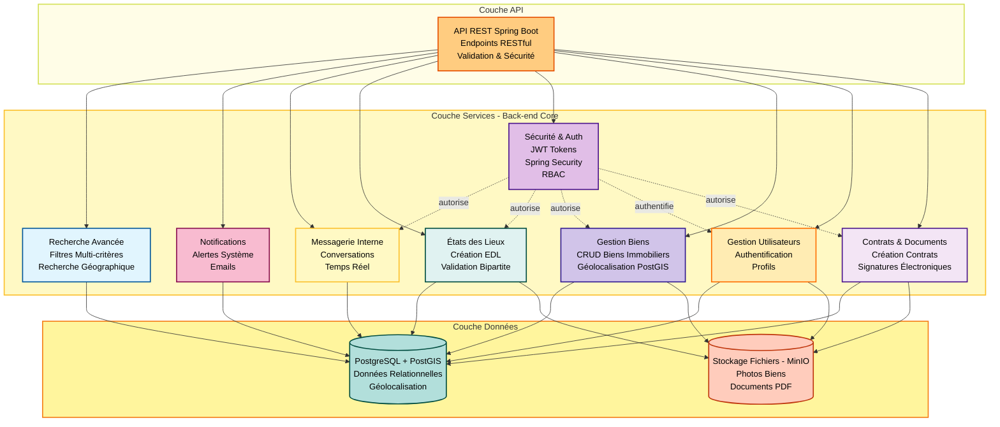

# Kupanga API


Bienvenue sur l'API de l'application Kupanga. Ce projet backend est construit avec Spring Boot et suit une architecture modulaire et sécurisée.

## 🚀 Installation & Démarrage

### Prérequis

*   Git
*   Docker & Docker Compose
*   Java 21 (pour le développement local sans Docker)

### 1. Cloner le dépôt

Via HTTPS :
```bash
git clone https://github.com/Kupanga-App/kupanga-Api.git
```

Ou via SSH :
```bash
git clone git@github.com:Kupanga-App/kupanga-Api.git
```

### 2. Lancer l'environnement (Docker)

Utilisez Docker Compose pour construire l'image et lancer tous les services (API, Base de données, MinIO) en arrière-plan :

```bash
docker compose -f docker-compose-dev.yml up -d
```
| Service              | URL / Commande                                                   | Identifiants / Info                                                                                     |
| :------------------- | :--------------------------------------------------------------- | :------------------------------------------------------------------------------------------------------ |
| **API Backend**      | `http://localhost:8089/`                                         | Point d'entrée de l'API                                                                                 |
| **Swagger UI**       | [Accéder à Swagger](http://localhost:8089/swagger-ui/index.html) | Documentation interactive de l'API                                                                      |
| **PostgreSQL**       | `localhost:5433/kupanga_dev`                                     | **User:** `kupanga`<br>**Password:** `devpassword`                                                      |
| **MinIO Console**    | [http://localhost:9001](http://localhost:9001)                   | **User:** `minioadmin`<br>**Password:** `minioadmin`                                                    |
| **Redis Cache**      | via CLI / terminal                                               | `redis-cli -h localhost -p 6379`<br>Exemples : `KEYS *` / `GET geocode::Paris:75001`                    |
| **RedisInsight GUI** | [http://localhost:5540](http://localhost:5540)                   | Ajouter une DB : <br>**URL:** `redis://redis-dev:6379`<br>**Host:** `redis-dev`<br>**Port:** `6379`<br>**Username:** (vide)<br>**Password:** (vide) |
> **Note :** Pour se connecter à la base de données via un outil externe comme pgAdmin, utilisez le port `5433` exposé par Docker.

## 🧪 Tests et Intégration Continue (CI/CD)

Le projet intègre des tests unitaires et d'intégration via **JUnit 5** et **Mockito**.
L'intégration continue est gérée par **GitHub Actions** pour assurer la qualité du code à chaque push.

```bash
# Lancer les tests manuellement (si Maven est installé)
./mvnw test
```

## 🏗️ Architecture Backend

L'architecture backend s'appuie sur une **architecture modulaire** (comportant des modules dédiés comme Utilisateur, Biens, etc.), permettant une meilleure maintenabilité et évolutivité du code.


