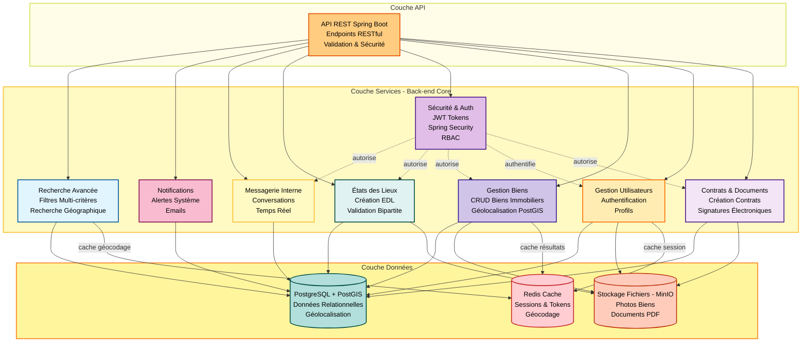
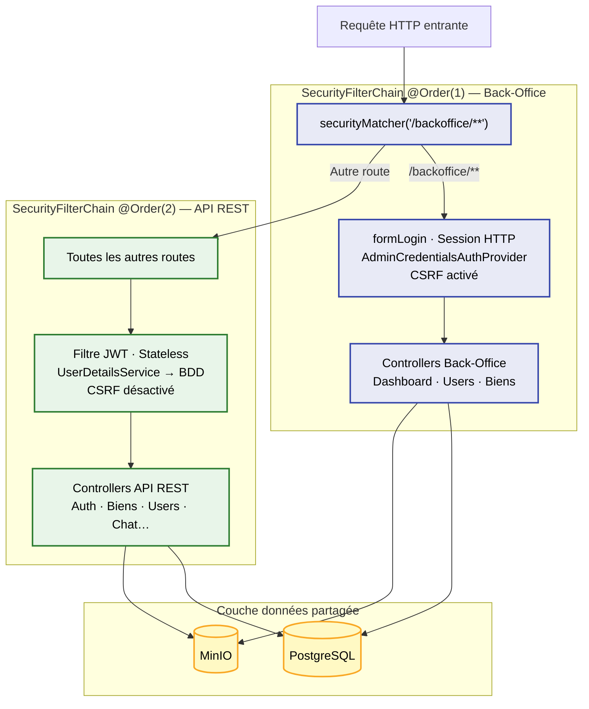
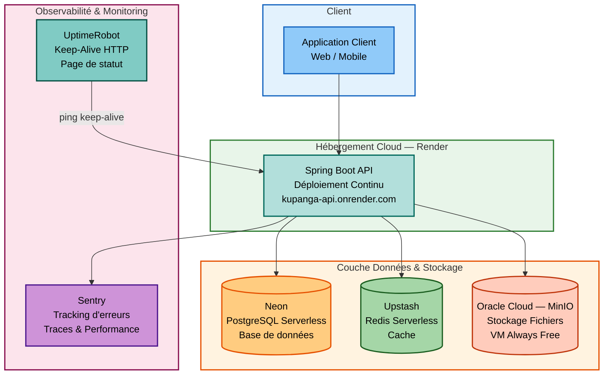

# Kupanga API


**Kupanga** est une plateforme de gestion locative immobilière complète. Elle couvre l'intégralité du cycle de vie d'une location : publication et recherche de biens, signature de contrats, états des lieux, génération de documents administratifs (contrats, quittances, EDL…), messagerie temps réel entre locataires et propriétaires, et suivi des notifications.

L'API est construite avec Spring Boot selon une architecture modulaire, sécurisée par JWT + RBAC, et expose des endpoints RESTful documentés via Swagger.

## ✨ Fonctionnalités

| Module | Description |
| :--- | :--- |
| 🔐 **Authentification & Sécurité** | Inscription, connexion, JWT, refresh token, contrôle d'accès par rôle (RBAC) |
| 🏠 **Gestion des Biens** | CRUD complet des biens immobiliers, géolocalisation PostGIS, photos via MinIO |
| 🔍 **Recherche Avancée** | Filtres multi-critères, recherche géographique par rayon, recherche par points d'intérêt (POI) — proximité écoles, crèches, pharmacies, hôpitaux, etc., cache Redis des résultats |
| 💬 **Messagerie Temps Réel** | Conversations propriétaire ↔ locataire via WebSocket STOMP |
| 📋 **États des Lieux** | Création, édition et validation bipartite des EDL avec pièces jointes |
| 📄 **Documents Administratifs** | Génération PDF automatisée : contrats de location, quittances de loyer, EDL signés |
| 🔔 **Notifications** | Alertes système et emails transactionnels |
| 👤 **Gestion Utilisateurs** | Profils propriétaires et locataires, gestion des documents d'identité |
| 🖥️ **Back-Office Administration** | Interface web dédiée (Thymeleaf + Bootstrap 5) — reporting, modération et gestion des utilisateurs & biens |

## 🚀 Installation & Démarrage

### Prérequis

*   Git
*   Docker & Docker Compose
*   Java 21 (pour le développement local sans Docker)

### 1. Cloner le dépôt

Via HTTPS :
```bash
git clone https://github.com/Kupanga-App/kupanga-Api.git
```

Ou via SSH :
```bash
git clone git@github.com:Kupanga-App/kupanga-Api.git
```

### 2. Lancer l'environnement (Docker)

Utilisez Docker Compose pour construire l'image et lancer tous les services (API, Base de données, MinIO) en arrière-plan :

```bash
docker compose -f docker-compose-dev.yml up -d
```
| Service              | URL / Commande                                                   | Identifiants / Info                                                                                     |
| :------------------- | :--------------------------------------------------------------- | :------------------------------------------------------------------------------------------------------ |
| **API Backend**      | `http://localhost:8089/`                                         | Point d'entrée de l'API                                                                                 |
| **Swagger UI**       | [Accéder à Swagger](http://localhost:8089/swagger-ui/index.html) | Documentation interactive de l'API                                                                      |
| **PostgreSQL**       | `localhost:5433/kupanga_dev`                                     | **User:** `kupanga`<br>**Password:** `devpassword`                                                      |
| **MinIO Console**    | [http://localhost:9001](http://localhost:9001)                   | **User:** `minioadmin`<br>**Password:** `minioadmin`                                                    |
| **Redis Cache**      | via CLI / terminal                                               | `redis-cli -h localhost -p 6379`<br>Exemples : `KEYS *` / `GET geocode::Paris:75001`                    |
| **RedisInsight GUI** | [http://localhost:5540](http://localhost:5540)                   | Ajouter une DB : <br>**URL:** `redis://redis-dev:6379`<br>**Host:** `redis-dev`<br>**Port:** `6379`<br>**Username:** (vide)<br>**Password:** (vide) |
> **Note :** Pour se connecter à la base de données via un outil externe comme pgAdmin, utilisez le port `5433` exposé par Docker.

## 🧪 Tests et Intégration Continue (CI/CD)

Le projet intègre des tests unitaires et d'intégration via **JUnit 5** et **Mockito**.
L'intégration continue est gérée par **GitHub Actions** pour assurer la qualité du code à chaque push.

```bash
# Lancer les tests manuellement (si Maven est installé)
./mvnw test
```

## 🏗️ Architecture Backend

L'API est découpée en **modules métier indépendants** (Biens, Utilisateurs, Contrats, Messagerie, EDL…) orchestrés par une couche sécurité centralisée (JWT + RBAC). Les données relationnelles et géospatiales sont gérées par PostgreSQL + PostGIS, le cache par Redis, et les fichiers (photos, PDFs) par MinIO.


```mermaid
graph TD
    %% Canvas Styles
    classDef apiLayer fill:#fffde7,stroke:#d4e157,stroke-width:2px;
    classDef serviceLayer fill:#fff9c4,stroke:#fbc02d,stroke-width:2px;
    classDef dataLayer fill:#fff59d,stroke:#f57f17,stroke-width:2px;
    
    %% Node Styles
    classDef apiNode fill:#ffcc80,stroke:#e65100,color:black,stroke-width:2px;
    classDef secNode fill:#e1bee7,stroke:#4a148c,color:black,stroke-width:2px;
    classDef searchNode fill:#e1f5fe,stroke:#01579b,color:black,stroke-width:2px;
    classDef notifNode fill:#f8bbd0,stroke:#880e4f,color:black,stroke-width:2px;
    classDef msgNode fill:#fff9c4,stroke:#fbc02d,color:black,stroke-width:2px;
    classDef edlNode fill:#e0f2f1,stroke:#004d40,color:black,stroke-width:2px;
    classDef propNode fill:#d1c4e9,stroke:#311b92,color:black,stroke-width:2px;
    classDef userNode fill:#ffecb3,stroke:#ff6f00,color:black,stroke-width:2px;
    classDef docNode fill:#f3e5f5,stroke:#4a148c,color:black,stroke-width:2px;
    classDef dbNode fill:#b2dfdb,stroke:#004d40,color:black,stroke-width:2px;
    classDef storageNode fill:#ffccbc,stroke:#bf360c,color:black,stroke-width:2px;
    classDef cacheNode fill:#ffcdd2,stroke:#c62828,color:black,stroke-width:2px;

    subgraph API["Couche API"]
        direction TB
        ApiBoot["API REST Spring Boot<br/>Endpoints RESTful<br/>Validation & Sécurité"]:::apiNode
    end
    class API apiLayer

    subgraph Services["Couche Services - Back-end Core"]
        direction TB
        %% Core Security
        Security["Sécurité & Auth<br/>JWT Tokens<br/>Spring Security<br/>RBAC"]:::secNode

        %% Modules
        Search["Recherche Avancée<br/>Filtres Multi-critères<br/>Recherche Géographique"]:::searchNode
        Notif["Notifications<br/>Alertes Système<br/>Emails"]:::notifNode
        Msg["Messagerie Interne<br/>Conversations<br/>Temps Réel"]:::msgNode
        EDL["États des Lieux<br/>Création EDL<br/>Validation Bipartite"]:::edlNode
        Prop["Gestion Biens<br/>CRUD Biens Immobiliers<br/>Géolocalisation PostGIS"]:::propNode
        Users["Gestion Utilisateurs<br/>Authentification<br/>Profils"]:::userNode
        Docs["Contrats & Documents<br/>Création Contrats<br/>Signatures Électroniques"]:::docNode
    end
    class Services serviceLayer

    subgraph Data["Couche Données"]
        direction TB
        Postgres[("PostgreSQL + PostGIS<br/>Données Relationnelles<br/>Géolocalisation")]:::dbNode
        Redis[("Redis Cache<br/>Sessions & Tokens<br/>Géocodage")]:::cacheNode
        Minio[("Stockage Fichiers - MinIO<br/>Photos Biens<br/>Documents PDF")]:::storageNode
    end
    class Data dataLayer

    %% Relations API -> Services
    ApiBoot --> Search
    ApiBoot --> Notif
    ApiBoot --> Msg
    ApiBoot --> EDL
    ApiBoot --> Security
    ApiBoot --> Prop
    ApiBoot --> Users
    ApiBoot --> Docs

    %% Auth Relations
    Security -.->|autorise| Msg
    Security -.->|autorise| EDL
    Security -.->|autorise| Prop
    Security -.->|authentifie| Users
    Security -.->|autorise| Docs

    %% Services -> Data
    Search --> Postgres
    Search -->|cache géocodage| Redis
    Notif --> Postgres
    Msg --> Postgres
    EDL --> Postgres
    EDL --> Minio
    Prop --> Postgres
    Prop --> Minio
    Prop -->|cache résultats| Redis
    Users --> Postgres
    Users --> Minio
    Users -->|cache session| Redis
    Docs --> Postgres
    Docs --> Minio
```

---

## 🖥️ Back-Office Administration


Le back-office est une interface web **server-side** (Thymeleaf + Bootstrap 5) embarquée directement dans le même serveur Spring Boot. Il est accessible sur la même URL que l'API, sous le préfixe `/backoffice`, et ne nécessite aucun déploiement front séparé.

### 🔑 Accès & Authentification

> 🔗 **Accès direct :** [https://kupanga-api.onrender.com/backoffice/](https://kupanga-api.onrender.com/backoffice/)

L'authentification du back-office est **totalement isolée** de l'authentification JWT de l'application principale. Elle repose sur une session HTTP Spring Security classique (formLogin) et des credentials stockés en variables d'environnement — aucun utilisateur en base de données n'est requis.

| Variable d'environnement | Rôle |
| :--- | :--- |
| `ADMIN_EMAIL` | Email de connexion de l'administrateur |
| `ADMIN_PASSWORD` | Mot de passe de connexion de l'administrateur |

| Route | Description |
| :--- | :--- |
| `/backoffice/login` | Page de connexion admin |
| `/backoffice/dashboard` | Tableau de bord — statistiques globales |
| `/backoffice/users` | Gestion et modération des utilisateurs |
| `/backoffice/biens` | Gestion et modération des biens |
| `/backoffice/logout` | Déconnexion (invalidation session + cookie) |

### 📊 Fonctionnalités

| Section | Reporting | Modération |
| :--- | :--- | :--- |
| **Tableau de bord** | Total utilisateurs, locataires, propriétaires · Total biens · Villes couvertes · Répartition par ville et par type | — |
| **Utilisateurs** | Recherche paginée multi-critères (prénom, nom, email, rôle) · Photo de profil ou avatar par défaut | Suppression unitaire avec confirmation |
| **Biens** | Recherche paginée multi-critères (titre, ville, type) · Carousel photos (MinIO) + compteur | Suppression unitaire avec confirmation |

### 🏗️ Architecture dédiée

Le back-office est entièrement isolé dans le package `com.kupanga.api.backoffice`, calqué sur l'architecture modulaire existante.

```
com.kupanga.api.backoffice/
│
├── config/
│   ├── BackOfficeSecurityConfig.java   ← SecurityFilterChain @Order(1), /backoffice/**
│   └── AdminCredentialsAuthProvider.java ← AuthenticationProvider sans BDD
│
├── controller/
│   ├── BackOfficeAuthController.java   ← GET /backoffice/login
│   ├── BackOfficeDashboardController.java ← GET /backoffice/dashboard
│   ├── BackOfficeUserController.java   ← GET /backoffice/users · POST /{id}/supprimer
│   └── BackOfficeBienController.java   ← GET /backoffice/biens · POST /{id}/supprimer
│
├── service/
│   ├── UserAdminService.java           ← Recherche paginée, comptages, suppression
│   └── BienAdminService.java           ← Recherche paginée, stats reporting, suppression
│
├── specification/
│   ├── UserAdminSpecification.java     ← Filtres JPA : prénom, nom, email, rôle
│   └── BienAdminSpecification.java     ← Filtres JPA : titre, ville, type
│
└── dto/
    ├── UserAdminSearchDTO / UserAdminDTO / UserAdminPageDTO
    └── BienAdminSearchDTO / BienAdminDTO / BienAdminPageDTO

resources/templates/backoffice/
├── login.html
├── dashboard.html
├── users/list.html
├── biens/list.html
└── fragments/layout.html              ← Sidebar, topbar, styles Bootstrap 5 (fragments réutilisables)
```

### 🔐 Double chaîne de sécurité

L'application fait coexister deux `SecurityFilterChain` Spring Security sans conflit, grâce à `securityMatcher` et `@Order` :


```mermaid
graph TD
    classDef chainA fill:#e8eaf6,stroke:#3949ab,stroke-width:2px,color:black;
    classDef chainB fill:#e8f5e9,stroke:#2e7d32,stroke-width:2px,color:black;
    classDef infra fill:#fff9c4,stroke:#f9a825,stroke-width:2px,color:black;

    Request["Requête HTTP entrante"]

    subgraph Chain1["SecurityFilterChain @Order(1) — Back-Office"]
        direction TB
        Matcher1["securityMatcher('/backoffice/**')"]:::chainA
        FormLogin["formLogin · Session HTTP<br/>AdminCredentialsAuthProvider<br/>CSRF activé"]:::chainA
        BackControllers["Controllers Back-Office<br/>Dashboard · Users · Biens"]:::chainA
    end

    subgraph Chain2["SecurityFilterChain @Order(2) — API REST"]
        direction TB
        Matcher2["Toutes les autres routes"]:::chainB
        JwtFilter["Filtre JWT · Stateless<br/>UserDetailsService → BDD<br/>CSRF désactivé"]:::chainB
        ApiControllers["Controllers API REST<br/>Auth · Biens · Users · Chat…"]:::chainB
    end

    subgraph Shared["Couche données partagée"]
        direction LR
        DB[("PostgreSQL")]:::infra
        Minio[("MinIO")]:::infra
    end

    Request --> Matcher1
    Matcher1 -->|"/backoffice/**"| FormLogin
    FormLogin --> BackControllers
    BackControllers --> DB
    BackControllers --> Minio

    Matcher1 -->|"Autre route"| Matcher2
    Matcher2 --> JwtFilter
    JwtFilter --> ApiControllers
    ApiControllers --> DB
    ApiControllers --> Minio
```

---

## ☁️ Infrastructure & DevOps


### 🧱 Stack technique

| Technologie | Rôle |
| :--- | :--- |
| **Spring Boot** | API backend |
| **Render** | Déploiement cloud — [https://kupanga-api.onrender.com](https://kupanga-api.onrender.com) |
| **Neon** | Base de données PostgreSQL serverless |
| **Upstash** | Cache Redis serverless |
| **Sentry** | Monitoring et tracking d'erreurs — [Traces & Performance](https://apprentissage.sentry.io/explore/traces/?mode=samples&project=-1&statsPeriod=14d) |
| **UptimeRobot** | Keep-alive et monitoring HTTP — [Page de statut](https://stats.uptimerobot.com/TGJ2ot3L7D) |
| **Oracle Cloud** | Hébergement MinIO stockage fichiers (VM Always Free) |

### 🗺️ Architecture d'Infrastructure


```mermaid
graph TD
    %% Canvas Styles
    classDef clientLayer fill:#e3f2fd,stroke:#1565c0,stroke-width:2px;
    classDef hostLayer fill:#e8f5e9,stroke:#2e7d32,stroke-width:2px;
    classDef dataLayer fill:#fff3e0,stroke:#e65100,stroke-width:2px;
    classDef monitorLayer fill:#fce4ec,stroke:#880e4f,stroke-width:2px;

    %% Node Styles
    classDef clientNode fill:#90caf9,stroke:#1565c0,color:black,stroke-width:2px;
    classDef renderNode fill:#b2dfdb,stroke:#00695c,color:black,stroke-width:2px;
    classDef neonNode fill:#ffcc80,stroke:#e65100,color:black,stroke-width:2px;
    classDef upstashNode fill:#a5d6a7,stroke:#1b5e20,color:black,stroke-width:2px;
    classDef minioNode fill:#ffccbc,stroke:#bf360c,color:black,stroke-width:2px;
    classDef sentryNode fill:#ce93d8,stroke:#4a148c,color:black,stroke-width:2px;
    classDef uptimeNode fill:#80cbc4,stroke:#004d40,color:black,stroke-width:2px;

    subgraph Client["Client"]
        direction TB
        ClientApp["Application Client<br/>Web / Mobile"]:::clientNode
    end
    class Client clientLayer

    subgraph Hosting["Hébergement Cloud — Render"]
        direction TB
        Render["Spring Boot API<br/>Déploiement Continu<br/>kupanga-api.onrender.com"]:::renderNode
    end
    class Hosting hostLayer

    subgraph Data["Couche Données & Stockage"]
        direction TB
        Neon[("Neon<br/>PostgreSQL Serverless<br/>Base de données")]:::neonNode
        Upstash[("Upstash<br/>Redis Serverless<br/>Cache")]:::upstashNode
        MinIO[("Oracle Cloud — MinIO<br/>Stockage Fichiers<br/>VM Always Free")]:::minioNode
    end
    class Data dataLayer

    subgraph Monitor["Observabilité & Monitoring"]
        direction TB
        Sentry["Sentry<br/>Tracking d'erreurs<br/>Traces & Performance"]:::sentryNode
        UptimeRobot["UptimeRobot<br/>Keep-Alive HTTP<br/>Page de statut"]:::uptimeNode
    end
    class Monitor monitorLayer

    %% Relations Client → API
    ClientApp --> Render

    %% Relations API → Données
    Render --> Neon
    Render --> Upstash
    Render --> MinIO

    %% Relations API → Observabilité
    Render --> Sentry

    %% UptimeRobot surveille l'API
    UptimeRobot -->|ping keep-alive| Render
```
