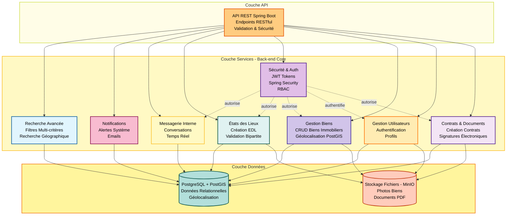

# Kupanga API


Bienvenue sur l'API de l'application Kupanga. Ce projet backend est construit avec Spring Boot et suit une architecture modulaire et sécurisée.

## 🚀 Installation & Démarrage

### Prérequis

*   Git
*   Docker & Docker Compose
*   Java 21 (pour le développement local sans Docker)

### 1. Cloner le dépôt

Via HTTPS :
```bash
git clone https://github.com/Kupanga-App/kupanga-Api.git
```

Ou via SSH :
```bash
git clone git@github.com:Kupanga-App/kupanga-Api.git
```

### 2. Lancer l'environnement (Docker)

Utilisez Docker Compose pour construire l'image et lancer tous les services (API, Base de données, MinIO) en arrière-plan :

```bash
docker compose -f docker-compose-dev.yml up -d
```

## 🛠️ Accès et Configuration

Une fois les conteneurs démarrés, vous pouvez accéder aux différents services :

| Service | URL / Commande | Identifiants / Info |
| :--- | :--- | :--- |
| **API Backend** | `http://localhost:8089/` | Point d'entrée de l'API |
| **Swagger UI** | [Accéder à Swagger](http://localhost:8089/swagger-ui/index.html) | Documentation interactive de l'API |
| **PostgreSQL** | `localhost:5433/kupanga_dev` | **User:** `kupanga`<br>**Password:** `devpassword` |
| **MinIO Console**| [http://localhost:9001](http://localhost:9001) | **User:** `minioadmin`<br>**Password:** `minioadmin` |

> **Note :** Pour se connecter à la base de données via un outil externe comme pgAdmin, utilisez le port `5433` exposé par Docker.

## 🧪 Tests et Intégration Continue (CI/CD)

Le projet intègre des tests unitaires et d'intégration via **JUnit 5** et **Mockito**.
L'intégration continue est gérée par **GitHub Actions** pour assurer la qualité du code à chaque push.

```bash
# Lancer les tests manuellement (si Maven est installé)
./mvnw test
```

## 🏗️ Architecture Backend

L'architecture backend s'appuie sur une **architecture modulaire** (comportant des modules dédiés comme Utilisateur, Biens, etc.), permettant une meilleure maintenabilité et évolutivité du code.


```mermaid
graph TD
    %% Canvas Styles
    classDef apiLayer fill:#fffde7,stroke:#d4e157,stroke-width:2px;
    classDef serviceLayer fill:#fff9c4,stroke:#fbc02d,stroke-width:2px;
    classDef dataLayer fill:#fff59d,stroke:#f57f17,stroke-width:2px;
    
    %% Node Styles
    classDef apiNode fill:#ffcc80,stroke:#e65100,color:black,stroke-width:2px;
    classDef secNode fill:#e1bee7,stroke:#4a148c,color:black,stroke-width:2px;
    classDef searchNode fill:#e1f5fe,stroke:#01579b,color:black,stroke-width:2px;
    classDef notifNode fill:#f8bbd0,stroke:#880e4f,color:black,stroke-width:2px;
    classDef msgNode fill:#fff9c4,stroke:#fbc02d,color:black,stroke-width:2px;
    classDef edlNode fill:#e0f2f1,stroke:#004d40,color:black,stroke-width:2px;
    classDef propNode fill:#d1c4e9,stroke:#311b92,color:black,stroke-width:2px;
    classDef userNode fill:#ffecb3,stroke:#ff6f00,color:black,stroke-width:2px;
    classDef docNode fill:#f3e5f5,stroke:#4a148c,color:black,stroke-width:2px;
    classDef dbNode fill:#b2dfdb,stroke:#004d40,color:black,stroke-width:2px;
    classDef storageNode fill:#ffccbc,stroke:#bf360c,color:black,stroke-width:2px;

    subgraph API["Couche API"]
        direction TB
        ApiBoot["API REST Spring Boot<br/>Endpoints RESTful<br/>Validation & Sécurité"]:::apiNode
    end
    class API apiLayer

    subgraph Services["Couche Services - Back-end Core"]
        direction TB
        %% Core Security
        Security["Sécurité & Auth<br/>JWT Tokens<br/>Spring Security<br/>RBAC"]:::secNode

        %% Modules
        Search["Recherche Avancée<br/>Filtres Multi-critères<br/>Recherche Géographique"]:::searchNode
        Notif["Notifications<br/>Alertes Système<br/>Emails"]:::notifNode
        Msg["Messagerie Interne<br/>Conversations<br/>Temps Réel"]:::msgNode
        EDL["États des Lieux<br/>Création EDL<br/>Validation Bipartite"]:::edlNode
        Prop["Gestion Biens<br/>CRUD Biens Immobiliers<br/>Géolocalisation PostGIS"]:::propNode
        Users["Gestion Utilisateurs<br/>Authentification<br/>Profils"]:::userNode
        Docs["Contrats & Documents<br/>Création Contrats<br/>Signatures Électroniques"]:::docNode
    end
    class Services serviceLayer

    subgraph Data["Couche Données"]
        direction TB
        Postgres[("PostgreSQL + PostGIS<br/>Données Relationnelles<br/>Géolocalisation")]:::dbNode
        Minio[("Stockage Fichiers - MinIO<br/>Photos Biens<br/>Documents PDF")]:::storageNode
    end
    class Data dataLayer

    %% Relations API -> Services
    ApiBoot --> Search
    ApiBoot --> Notif
    ApiBoot --> Msg
    ApiBoot --> EDL
    ApiBoot --> Security
    ApiBoot --> Prop
    ApiBoot --> Users
    ApiBoot --> Docs

    %% Auth Relations
    Security -.->|autorise| Msg
    Security -.->|autorise| EDL
    Security -.->|autorise| Prop
    Security -.->|authentifie| Users
    Security -.->|autorise| Docs

    %% Services -> Data
    Search --> Postgres
    Notif --> Postgres
    Msg --> Postgres
    EDL --> Postgres
    EDL --> Minio
    Prop --> Postgres
    Prop --> Minio
    Users --> Postgres
    Users --> Minio
    Docs --> Postgres
    Docs --> Minio
```
